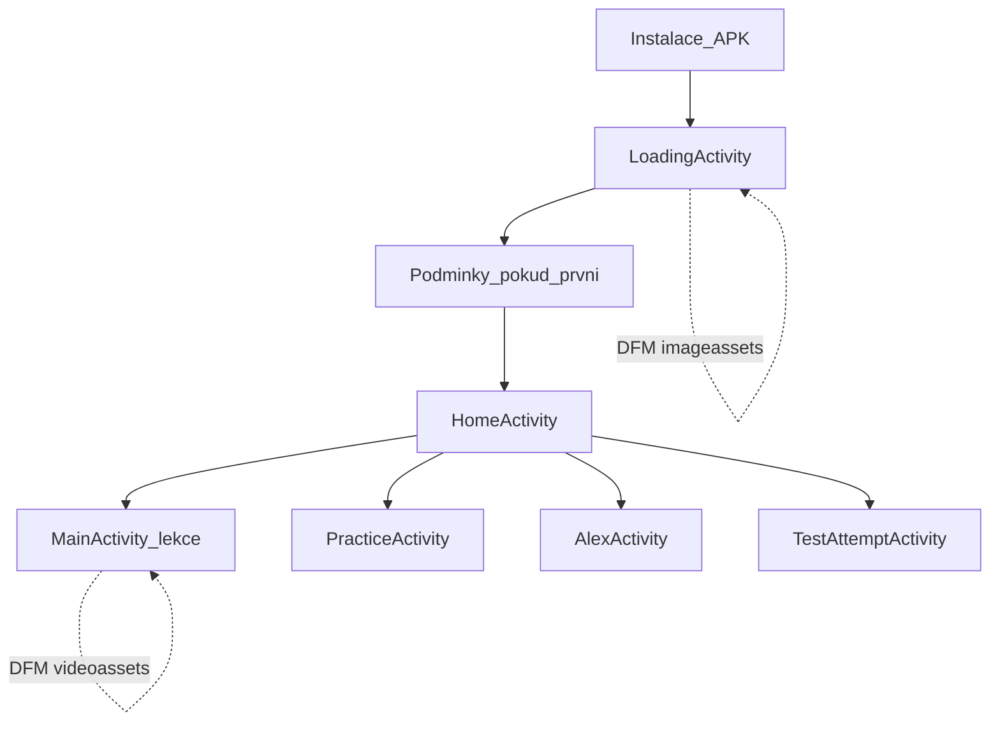

# Revizní audit — Autoškolák

Tento dokument je výstupem plánované velké revize (inventura, úložiště, stabilita, architektura, UX, použitelnost, design, výkon, pozadí, compliance, testy, release). Slouží jako jediný přehled: **co je v pořádku**, **co opravit**, **co zlepšit** a **nápady do budoucna**.

---

## 1. Executive summary

Aplikace **Autoškolák** (`cz.autokolk`, minSdk 24, targetSdk 35) je monolitická hra/vzdělávací app s dynamickými moduly pro obrázky a videa, AdMob reklamami a JobScheduler notifikacemi. **Silné stránky:** jasná dělba obsahu přes Play Feature Delivery, blokující `LoadingActivity` pro `imageassets`, úklid temp videí v `MainActivity.onDestroy`, portrait lock, společná báze `AutokolkActivity` pro systémové okna. **Hlavní rizika a dluhy:** obří `MainActivity` (~1375 řádků) a `LessonProgress` (~885 řádků), kopírování každého videa do `cacheDir` při přehrání, slabá uživatelská viditelnost stavu stahování video-modulů (často jen skrytý kontejner + log), `isMinifyEnabled = false` v release, `usesCleartextTraffic="true"`, smíšená lokalizace notifikací (AJ/CZ), statický Lint audit v tomto běhu **nespuštěn** (build selhal na zamčeném `R.jar` — viz metodika). **Použitelnost:** navigace přes spodní menu konzistentně přepíná aktivity `finish()` + `CLEAR_TOP`; cena je ztráta back-stacku a nutnost znovu načíst obrazovku — pro cílovou skupinu obvykle přijatelné, ale hluboké stromy v procvičování a čekání na DFM zvyšují kognitivní zátěž.

---

## 2. Metodika revize

| Položka | Hodnota |
|--------|---------|
| **Datum** | 2026-04-14 |
| **Analyzovaná verze (kód)** | `versionName` 2.0.11 → po této změně dokumentace 2.0.12 (`app/build.gradle.kts`) |
| **Způsob** | Statická analýza zdrojového kódu a manifestu, částečné čtení klíčových tříd, kontrola `.gitignore`; **bez** běhu aplikace na zařízení |
| **Lint** | Příkaz `gradlew :app:lintDebug` skončil chybou `Couldn't delete ... R.jar` (typicky souběh s Android Studiem / zamčený soubor). **Doporučení:** zavřít IDE build, spustit Lint znovu a výsledky (`app/build/reports/lint-results-debug.html`) doplnit do přílohy auditu. |

**Legenda typů:** bug · dluh · UX · použitelnost · výkon · compliance  
**Legenda priorit:** P0 kritické · P1 vysoké · P2 střední · P3 nízké / nápad  

**Stavy v textu:** **[OK]** funguje / přijatelné · **[opravit]** chyba nebo riziko · **[zlepšit]** měřitelné tření · **[nápad]** backlog bez závazku  

---

## 3. Moduly a distribuce obsahu

| Oblast | Stav | Poznámka |
|--------|------|----------|
| Moduly Gradle (`settings.gradle.kts`) | **[OK]** | `:app`, `:imageassets`, `:videoassets1`–`:videoassets5` |
| `dynamicFeatures` v `app/build.gradle.kts` | **[OK]** | Shoda se seznamem modulů |
| `imageassets` — žádost o instalaci | **[OK] / [zlepšit]** | `App.onCreate` + `LoadingActivity` — dvojí request je idempotentní, ale zdvojené logování/sessions zbytečné **[P3, dluh]** |
| `videoassets*` — on-demand | **[OK] / [zlepšit]** | Mapování soubor → modul v `MainActivity`; uživatel při chybějícím modulu nevidí vysvětlující UI, jen schované video **[P2, UX/použitelnost]** |
| Velikosti modulů v auditu | **[nápad]** | Občasně exportovat velikosti z Play Console nebo `bundletool` pro evidenci |

---

## 4. Úložiště, cache, DFM

| ID | Priorita | Typ | Popis |
|----|----------|-----|--------|
| S1 | P1 | výkon / úložiště | **`MainActivity.handleVideoDisplay`:** celé video se kopíruje z assetů do `File.createTempFile(..., cacheDir)` + `deleteOnExit()`. Při rychlé změně otázek nebo opakování se opakovaně zapisuje velké množství dat na flash. **[zlepšit]** zvážit `MediaPlayer`/`ExoPlayer` z `AssetFileDescriptor`, nebo jednorázová extrakce s LRU cache. |
| S2 | P2 | bug / úložiště | Při **nedostatku místa** není v tomto bloku specifická uživatelská větev — obecný `catch` schová video. **[opravit]** rozlišit `ENOSPC`, zobrazit hlášku. |
| S3 | P2 | UX | **`pendingVideoPath` + SplitInstall:** po stažení modulu závislost na listeneru — ověřit v zařízení, že se video vždy doplní a nepřijde „tichá“ otázka bez média. |
| S4 | P3 | dluh | `deleteOnExit()` je křehké při kill procesu — `onDestroy` maže `currentVideoFile` **[OK]** jako hlavní záruka. |
| S5 | P2 | použitelnost | **`LoadingActivity`:** `onBackPressed` prázdný — záměr blokovat odchod **[OK]** pro integritu; uživatel bez sítě může být frustrovaný **[zlepšit]** text nápovědy „zkuste Wi‑Fi / mobilní data“. |
| S6 | P2 | compliance | Duplicitní žádost o `imageassets` z `App` i `LoadingActivity` — mírné zvýšení síťové aktivity; sjednotit jedním místem **[zlepšit]**. |

**Co je v pořádku:** před načtením nového videa se maže předchozí soubor; v `onDestroy` se volá `stopPlayback()` a mazání temp souboru; `LoadingActivity` řeší `REQUIRES_USER_CONFIRMATION` větví listeneru (stejně jako instalaci — UI zůstává v loading stavu).

---

## 5. Stabilita, chyby, edge cases

| ID | Priorita | Typ | Popis |
|----|----------|-----|--------|
| T1 | P2 | bug | Produkční chování závislé na **Play službách** pro DFM — na zařízeních bez Google Play selže instalace modulů; scénář by měl být popsán v auditu obchodu nebo v app **[nápad]**. |
| T2 | P2 | UX | **`REQUIRES_USER_CONFIRMATION`:** uživatel musí potvrdit stahování z Play — ověřit, že `LoadingActivity` zobrazí srozumitelně, že je potřeba potvrdit dialog (může být mimo aktivitu). |
| T3 | P3 | dluh | Rozsáhlé `try/catch` s obecným `Exception` v `MainActivity` — ztěžuje diagnostiku. |
| T4 | — | — | **Changelog** (`CHANGELOG.md`) obsahuje nedávné opravy (intro obrázky, Alex death, interstitial preload) — dobrý zdroj regresních scénářů **[OK]**. |

**Ruční checklist (doplnit výsledkem testu na zařízení):** první start, odmítnutí podmínek, instalace DFM na pomalé síti, lekce s videem z každého `videoassetsN`, test časomíry, smrt Alexe, odměna za reklamu životů.

**Lint:** neprovedeno (viz §2).  

**Logování:** četné `Log.d/e` v `MainActivity` — v release buildu zůstávají no-op nebo nízká úroveň podle ProGuardu; **`isMinifyEnabled = false`** znamená, že řetězce zůstávají v APK **[zlepšit]** omezit citlivé řetězce v logu.

---

## 6. Architektura a udržovatelnost

| ID | Priorita | Typ | Popis |
|----|----------|-----|--------|
| A1 | P1 | dluh | **`MainActivity.kt` ~1375 řádků** — lekce, test, video, SplitInstall, reklamy, timer. **[zlepšit]** postupný extrakt (ViewModel, use cases, samostatná třída pro video+DFM). |
| A2 | P1 | dluh | **`LessonProgress.kt` ~885 řádků** — persistence, ekonomika, streak, praxe. **[zlepšit]** rozdělit na repozitáře podle domény. |
| A3 | P3 | dluh | Balíček jednotně **`cz.autokolk`** (složka `autokolk/` je jen struktura) — **[OK]** z hlediska konzistence deklarací. |
| A4 | P2 | dluh | **`Compose` je zapnuté** v `build.gradle.kts`, UI je převážně XML — zvážit odstranění nepoužívaných Compose závislostí nebo nové obrazovky v Compose **[nápad]**. |
| A5 | P2 | architektura | Spodní navigace **restartuje activity** (`finish`) — předvídatelné, ale duplicitní inicializační kód na více obrazovkách **[zlepšit]** sdílené helpery / base fragment. |

**Co je přijatelné:** pro solo/small team je jeden velký activity běžný dluh; dokumentace zde slouží k řízení refaktoru po částech.

---

## 7. Funkční oblasti (5 stran + související)

### Home (`HomeActivity`, cesta lekcí)
- **[OK]** Hlavní vstup po načtení; Duolingo-like metafora.
- **[zlepšit]** Závislost na `imageassets` — bez modulu uživatel neprojde (záměr).
- **[nápad]** Rychlý návrat na „aktuální“ lekci po přepnutí tabu.

### Alex (`AlexActivity`, fragmenty)
- **[OK]** Kontrola `imageassets` v kódu (např. při načítání bitmap).
- **[zlepšit]** Notifikace hladu v AJ (viz §10) vs česká app.

### Test (`TestAttemptActivity` → `MainActivity` / výsledky)
- **[OK]** Samostatné aktivity pro pokusy a statistiky.
- **[zlepšit]** Ujistit se, že časovač a `onPause`/`onResume` nemohou uživatele připravit o čas při přerušení (částečně řešeno v kódu timeru).

### Procvičování (`PracticeActivity`)
- **[OK]** Sekce „Tvoje chyby“ (changelog) — silná pedagogická hodnota.
- **[zlepšit]** Hloubka kategorií — projít, kolik úrovní rozbalení je typicky potřeba (task analysis v §8).

### Nastavení (`SettingsActivity`)
- **[OK]** Úspěchy, vymazání dat, changelog přes footer.
- **[opravit] / [zlepšit]** Vývojářská sekce a heslo (§11).

### Další obrazovky
- `ReadingLessonActivity`, `ResultsActivity`, `StreakActivity`, `AchievementsActivity`, `ChangelogActivity`, `AlexDeathActivity`, `TestAttemptStatsActivity`, `TestResultsActivity` — mapované v manifestu **[OK]**.

---

## 8. Použitelnost a friction (kliky, přehlednost)

**Metoda:** odhad z navigace v kódu (bottom nav vždy `startActivity` + `finish` na cílové obrazovce). **Skutečné počty kliků** závisí na umístění prvků — doporučeno doplnit pozorováním 2–3 uživatelů.

### Tabulka úkolů (orientační)

| Úkol | Aktuální tok (orientačně) | Tření | Návrh |
|------|---------------------------|-------|--------|
| Přepnout z Home na Procvičování | 1× spodní ikona | Activity se znovu vytvoří | **[OK]** pokud je rychlé; **[nápad]** Single Activity + NavHost sníží restart |
| Spustit lekci z cesty | 1× výběr lekce (+ případně intro) | Čekání na video modul | Progress / text „stahujeme video balíček“ |
| Doplnit životy reklamou | Horní lišta → sheet → tlačítko odměny | více kroků nutných kvůli AdMob | **[OK]** běžný pattern; zvážit viditelnost „Získat život“ |
| Otevřít nastavení z libovolné stránky | 1× poslední tab | — | **[OK]** |
| První spuštění bez sítě | Loading + retry | Vysoká frustrace | **[zlepšit]** jasná instrukce k síti + offline režim s textem |

### Konkrétní body
- **[zlepšit] [použitelnost]** Chybějící video modul: UI se schová, uživatel nemusí rozumět proč (§4).
- **[OK] [použitelnost]** `LoadingActivity` blokuje Back — konzistentní s „nutný obsah“.
- **[zlepšit]** Terms dialog v `LoadingActivity` — odkaz na soukromí; ověřit otevření v prohlížeči a návrat.
- **[nápad]** Double-tap na spodní navigaci — scroll na začátek seznamu lekcí (běžné očekávání u některých uživatelů).

### Podsekce pro konsolidaci plánu
- **Použitelnost — co je v pořádku:** jedna spodní lišta na hlavních pěti stránkách, srozumitelné ikony, horní metrika klikací.
- **Použitelnost — tření a zbytečné kliky:** čekání DFM bez vysvětlení; reklamní flow u životů (nutná daň za free model).
- **Nepřehledné / matoucí:** anglické texty v notifikaci hladu vs české UI.
- **Nápady na zkrácení toku:** snackbar s „Stáhnout video balíček“ přímo z otázky; predownload všech video modulů na pozadí po Wi‑Fi (uživatelsky volitelné).

---

## 9. UI, informační architektura, vizuální design

| ID | Priorita | Typ | Popis |
|----|----------|-----|--------|
| D1 | P2 | design | **Hardcoded barvy** v několika layoutech (`#CC000000` v `activity_settings.xml` header atd.) — **[zlepšit]** přes `@color` pro dark/light konzistenci. |
| D2 | P2 | UX | **`contentDescription`:** jen u části layoutů (např. `fragment_alex_page_two.xml` více než jinde) — **[zlepšit]** přístupnost TalkBack. |
| D3 | P3 | UX | `PracticeActivity` titulek „💪 Practice“ — mix EN/CZ **[zlepšit]** sjednotit jazyk (čeština). |
| D4 | P2 | design | Opakující se horní header 72dp + bottom nav — konzistence **[OK]** napříč XML. |

**Tutorial (`TutorialManager.kt`):** ověřit na zařízení po updatu (reset flagů) — **[nápad]** verzovat klíče tutorialu.

---

## 10. Výkon, média, reklamy

| ID | Priorita | Typ | Popis |
|----|----------|-----|--------|
| P1 | P1 | výkon | Kopírování videí (§4 S1). |
| P2 | P2 | výkon | Bitmapy Alex — `AlexDeadBitmapLoader` a podobně; držet downsampling / velikosti. |
| P3 | P2 | výkon / stabilita | **`LessonInterstitialAds` / `HeartsRewardAds`:** singleton drží odkaz na reklamu — držet `FullScreenContentCallback` bez leaků activity (aktuálně vypadá opatrně; ověřit při rotaci — portrait lock pomáhá). |
| P4 | P3 | UX | Preload interstitial z lekce — **[OK]** podle changelogu. |

**Video:** `onPause` pausuje přehrávání **[OK]**; `onDestroy` uklízí **[OK]**.

---

## 11. Background, notifikace, oprávnění

| Oblast | Stav | Detail |
|--------|------|--------|
| `POST_NOTIFICATIONS` (API 33+) | **[OK]** | V manifestu s `tools:targetApi` |
| `HeartRefillJobService` | **[OK]** | `JobInfo` s `NETWORK_TYPE_NONE`, notifikační kanál „Heart Refill“ |
| `HungerNotificationService` | **[zlepšit]** | Text notifikace **anglicky** (`He's on X%`) — nekonzistence s CZ UI **[P2, UX]**. |
| Přesné alarmy | **[OK]** | JobScheduler místo exact alarmů pro tento use-case |

---

## 12. Bezpečnost, soukromí, compliance

| ID | Priorita | Typ | Popis |
|----|----------|-----|--------|
| C1 | P1 | compliance | **`usesCleartextTraffic="true"`** — široké povolení HTTP. **[opravit]** pokud není nutné, vypnout a použít jen výjimky v `network_security_config`. |
| C2 | P2 | compliance | **`android:allowBackup="true"`** — obnova dat na novém zařízení; zkontrolovat, zda `lesson_progress` neobsahuje citlivé údaje (obvykle ne). |
| C3 | P1 | bezpečnost | **`DEVELOPER_OPTIONS_PASSWORD`** konstanta v `SettingsActivity` (`"autokolk_dev"`) — lepší než plaintext v changelogu, stále **triviální reverse engineering** **[zlepšit]** skrýt sekci v release (`BuildConfig.DEBUG`) nebo odstranit z production. |
| C4 | P2 | compliance | **AdMob** — zvážit UMP (GDPR) a odkaz na soukromí v nastavení (část máte přes terms v `LoadingActivity`). |
| C5 | P2 | compliance | **Ad unit ID** v kódu — běžné; ochrana je spíš na straně AdMob pravidel. |

---

## 13. Testování a kvalita

| Oblast | Stav |
|--------|------|
| Unit testy | Šablony `ExampleUnitTest` — **[zlepšit]** přidat testy na `LessonProgress` (srdce, streak, normalizace). |
| Instrumentované testy | Šablona — **[nápad]** smoke test spuštění `LoadingActivity`. |
| Matice zařízení | minSdk **24**, target **35** — otestovat API 24, 29, 33, 34+ |

---

## 14. Build, release, repozitář

| ID | Priorita | Typ | Popis |
|----|----------|-----|--------|
| R1 | P2 | release | **`isMinifyEnabled = false`** — větší APK/AAB, menší ochrana **[zlepšit]** zapnout R8 po důkladném proguard testu. |
| R2 | P2 | dluh | Složky **`videoassets*/build`** se objevovaly v `git status` jako změněné — nepatří do VCS. **[opravit]** rozšířit kořenový `.gitignore` (viz provedená změna `**/build/` nebo ekvivalent). |
| R3 | P3 | release | `versionName` vs footer v `activity_settings.xml` — udržovat synchronizované (pravidlo projektu). |

---

## 15. Backlog (prioritizovaný souhrn)

| Pořadí | ID | Krátce |
|--------|-----|--------|
| P0 | — | Žádný neověřený P0 z čistě statické analýzy; ověřit DFM + video na reálných zařízeních. |
| P1 | S1, A1, A2, C1, C3 | Video kopírování, refaktor velkých tříd, cleartext, dev sekce |
| P2 | S2, S3, S5, S6, T1/T2, D1/D2, P1 notifikace CZ, C4, R1/R2 | UX storage, DFM UI, i18n, a11y, GDPR/UMP, gitignore, minify |
| P3 | T3, A4, D3, R3 | Cleanup, Compose, jazykové detaily, verze |

---

## 16. Přílohy — klíčové soubory

- [`app/src/main/AndroidManifest.xml`](../app/src/main/AndroidManifest.xml)
- [`app/build.gradle.kts`](../app/build.gradle.kts)
- [`app/src/main/java/cz/autokolk/autokolk/MainActivity.kt`](../app/src/main/java/cz/autokolk/autokolk/MainActivity.kt)
- [`app/src/main/java/cz/autokolk/autokolk/LessonProgress.kt`](../app/src/main/java/cz/autokolk/autokolk/LessonProgress.kt)
- [`app/src/main/java/cz/autokolk/LoadingActivity.kt`](../app/src/main/java/cz/autokolk/LoadingActivity.kt)
- [`app/src/main/java/cz/autokolk/autokolk/App.kt`](../app/src/main/java/cz/autokolk/autokolk/App.kt)
- [`settings.gradle.kts`](../settings.gradle.kts)
- [`CHANGELOG.md`](../CHANGELOG.md)

**Otevřené otázky:** výsledek Lint po úspěšném buildu; chování `SplitInstallSessionStatus.REQUIRES_USER_CONFIRMATION` v produkci; měření času studeného startu po instalaci DFM.

---

*Konec dokumentu revizního auditu.*
